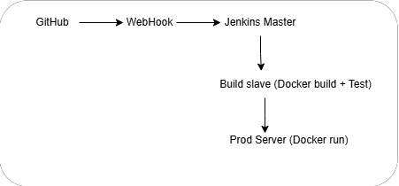

# DevOps Lifecycle Implementation

## Project Overview
Implemented a complete DevOps CI/CD pipeline for a web application using 
industry-standard tools on AWS.

## Architecture


## Tools Used
- **AWS EC2** — 3 instances (Jenkins Master, Build Slave, Prod Server)
- **Ansible** — automated software installation on all machines
- **Jenkins** — CI/CD pipeline with 3 jobs
- **Docker** — containerized the application
- **GitHub** — source code management with webhook integration

## Pipeline Flow
- Push to **develop** branch → Job1 triggers → builds Docker image + tests
- Push to **master** branch → Job2 triggers → builds + tests → Job3 deploys to prod

## How to Run
1. Clone the repo
2. Set up 3 EC2 instances
3. Run Ansible playbook to install dependencies
4. Configure Jenkins jobs as documented below
5. Add GitHub webhook pointing to Jenkins

## Jenkins Jobs Configuration
### Job1 - build,test (develop branch)
- Triggered by: push to develop branch
- Runs on: build-slave
- Steps: docker build → docker push → docker run → curl test

### Job2 - build,test (master branch)  
- Triggered by: push to master branch
- Runs on: build-slave
- Steps: docker build → docker push → docker run → curl test → triggers Job3

### Job3 - prod
- Triggered by: Job2
- Runs on: prod-server
- Steps: docker pull → docker run on port 80

## Jenkins Jobs - Build Steps
### Job1 - build,test (develop branch)
```bash
docker stop testcontainer || true
docker rm testcontainer || true
docker build -t devopstejas/myapp:latest .
docker login -u devopstejas -p $DOCKERHUB_PASS
docker push devopstejas/myapp:latest
docker run -d -p 8180:80 --name testcontainer devopstejas/myapp:latest
sleep 10
curl -f http://localhost:8180 || exit 1
docker stop testcontainer
docker rm testcontainer
```
### Job2 - build,test (master branch)
docker stop testcontainer || true
docker rm testcontainer || true
docker build -t devopstejas/myapp:latest .
docker login -u devopstejas -p $DOCKERHUB_PASS
docker push devopstejas/myapp:latest
docker run -d -p 8180:80 --name testcontainer devopstejas/myapp:latest
sleep 10
curl -f http://localhost:8180 || exit 1
docker stop testcontainer
docker rm testcontainer

### Job3 - prod
```bash
docker stop prodcontainer || true
docker rm prodcontainer || true
docker pull devopstejas/myapp:latest
docker run -d -p 80:80 --restart always --name prodcontainer devopstejas/myapp:latest
```

## Ansible Playbook
Installs on all machines: Java 21, Git, Docker
Installs on master only: Jenkins

## Dockerfile
```dockerfile
FROM hshar/webapp
COPY . /var/www/html
```

## Live Demo
Website deployed at: http://PROD_SERVER_IP
